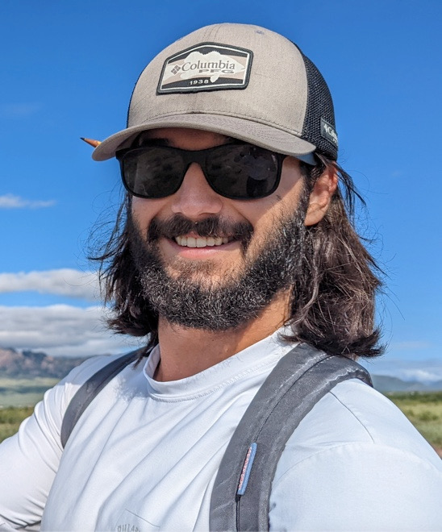

<h6 style="text-align: left;" markdown="1">

Email: mmadrzyk [at] stanford [dot] edu

```{r, echo=F, warning=F, message=F}
library(rmarkdown)
library(knitr)
library(jpeg)
```


###

```{r, echo=FALSE, fig.cap="", out.width = '30%', fig.align='center'}

```
   


</h6>     

I am currently a lab technician in the [*Gordon Lab*](https://web.stanford.edu/~dmgordon/people.html) at Stanford and incoming graduate student to the Stanford Biosciences PhD program. My research thus far has been focused on individual variation in ant behavior, ant community dynamics in relation to human disturbance, and competitive interactions between native and invasive ants. 


----------------------------------

## Publications

##

1. _**Madrzyk, M.**, & Pinter-Wollman, N. (2022)_ Colonies of ants allocate exploratory individuals to where they are ecologically needed. Current Zoology. [*PDF*](https://watermark.silverchair.com/zoac065.pdf?token=AQECAHi208BE49Ooan9kkhW_Ercy7Dm3ZL_9Cf3qfKAc485ysgAAAtkwggLVBgkqhkiG9w0BBwagggLGMIICwgIBADCCArsGCSqGSIb3DQEHATAeBglghkgBZQMEAS4wEQQMGoeoRu-0H6WFTKYfAgEQgIICjJJeYgdn0Xe0yseJQf6n-umlX8l3GNTjfaLvWGG2spZTHSxCDm7kxNB2VAOD-NvUrbVlt73Nj6tUHra5hNsyDWxJSmpUTifG4E2fd_ROxkcsVKvDhl2zH5Z-ebP4RPfD52HdU0YcOe1D11jMYRbtDEoeEkSFzD0EnzeFLL8H7LR5rxDWf3cnyfFHnzroTt68N1z3TYBtkeVT0iRwTxM8UE29-OfGTFr_jz1GKpA_sla3hII5BeSorAaMgUPp101qbcewmyauYLga5gg9TzVgYtF6bh-jqDgCWkcNEOsieHV-CpS8tjbxa-Mcp_dS_8ryzvw8yoUlupbuPIDgXXSzzAKKe-ftvZBuUIVxgG3LbjfW2qRioaLD68l2XiiAOtwkBgIhLkVC0j6SyMV1przh8Tj3pMaFfEGVwlsgloAC2Oq3Dwfg5nJLbklbwDqKQzadyV2OI02vT6su1VKdtXR_fTTleKMjsAPigbkdQI3CC6utjipSv3yBm8jENhlK4A0nQP_K8n9ap-UzKJAktOAdvnQ4hevubi2BpTpIZuSglSD-QsJR-jpne7FH4q7J0S6F3iT4k5OK_mWbtvDR1hCurqbj3LJoNQ_qUWkZKw2aINEcJh_jmHtzPEusPKXrr7kYAy73ZXURe3vjLGsz9N5rn3FQnRRvpjIGcH4SsFzrOnV59rpKwprDJGgLqSMLbu33tkxe8KUbONJiVul83SemLcPBn8eFPNdupIdyLrwV2ycI5-ox1OxVxVZl1DYLjnaccQ_yYklf0-NYTwmTV0wsKjQJrykcmS3UtVWuy-Rj-TEzZrynFxZmIt1lYi5-T5x7NtnFJ1HDi4h6N8QLLcfhBb6Pv00ZsWtB4UsVNlk)

2. _**Madrzyk, M.**, **Yang, M.**, Das, B., Fiocca, K., Vonshak, M., Gordon, D. (2023)_ Native and invasive   ant community dynamics in natural and disturbed habitats. _(in prep)_

----------------------------------

## Talks 

1. **IUSSI** July 2022 _Colonies of ants allocate exploratory individuals to where they are ecologically needed_

2. **UCLA Undergraduate Research Week** May 2022 _Colonies of ants allocate exploratory individuals to where they are ecologically needed_
