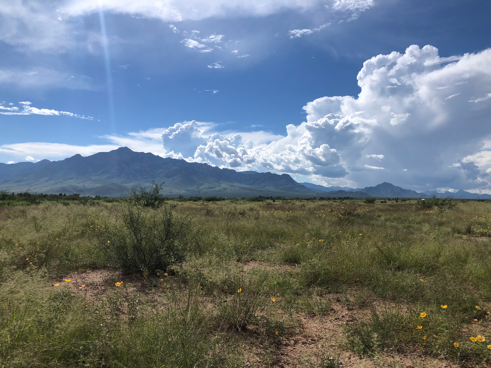
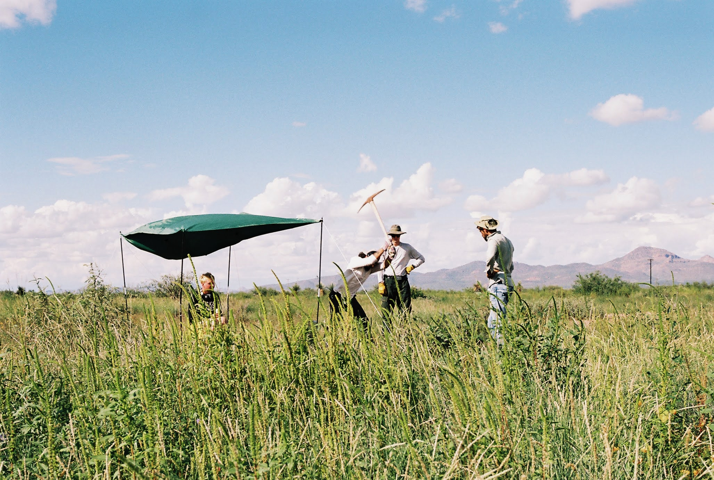

</h6> 
**Photos from the various field work**

```{r, echo=FALSE, fig.cap="Bryce Barbee and I in AZ (2021)", out.width = '100%', fig.align='left'}
knitr::include_graphics("max_bryce_field.jpeg")
```

```{r, echo=FALSE, fig.cap="Field site in AZ", out.width = '100%', fig.align='left'}

```

```{r, echo=FALSE, fig.cap="Ant colony excavation process", out.width = '100%', fig.align='left'}

```

```{r, echo=FALSE, fig.cap="Successful excavation of a _Pogonomyrmex barbatus_ colony", out.width = '100%', fig.align='left'}
knitr::include_graphics("colony_dig.jpeg")
```

